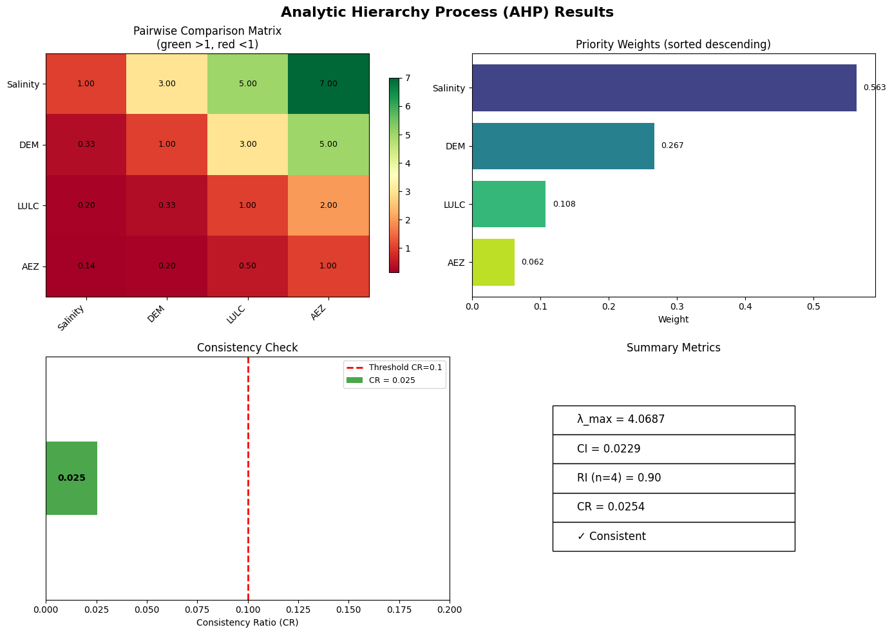

# AHP Calculator with Creative Visualizations

[](https://www.python.org/downloads/)
[](https://opensource.org/licenses/MIT)
[](https://matplotlib.org/)

An interactive command-line tool for performing **Analytic Hierarchy Process (AHP)** calculations. It collects pairwise comparisons using Saaty’s fundamental scale, computes priority weights, consistency indices, and provides rich visualizations of the results.

  
*Example output: heatmap, bar chart, consistency gauge, and summary table.*

---

## Features

- **Pairwise comparison input** – accepts numbers or fractions (e.g., `3`, `0.2`, `1/3`).
- **Automatic reciprocal matrix** – only the upper triangle is requested.
- **Priority vector** – calculated via the normalized column average method.
- **Consistency check** – computes λ_max, Consistency Index (CI), Random Index (RI), and Consistency Ratio (CR) with a clear warning if CR ≥ 0.1.
- **Rich visualizations** (if `matplotlib` and `numpy` are installed):
  - **Heatmap** of the pairwise comparison matrix (green >1, red <1).
  - **Sorted horizontal bar chart** of priority weights.
  - **Consistency gauge** showing CR against the 0.1 threshold.
  - **Summary table** with all key metrics.
- **Fallback to text mode** – if visualization libraries are missing, the script still performs all calculations and prints results to the console.

---

## Installation

1. **Clone the repository** (or download the script directly):
   ```bash
   git clone https://github.com/khandakerhiron/ahp-calculator-visualization.git
   cd ahp-calculator-visualization


Usage
Run the script from the terminal:

bash
python ahp_calculator.py
You will be guided through:

Number of indicators/criteria

Names for each indicator

Pairwise comparisons using Saaty’s scale (1–9 or fractions)

After entering all comparisons, the script displays:

The full pairwise matrix

Priority weights

Consistency metrics (λ_max, CI, RI, CR)

A consistency verdict

If matplotlib is installed, you will be asked whether to show the visualizations.

Example Session
text
=== AHP (Analytic Hierarchy Process) Calculator with Visualizations ===

Enter the number of indicators/criteria: 3
Enter name for indicator 1: Price
Enter name for indicator 2: Quality
Enter name for indicator 3: Brand

Now enter pairwise comparisons using Saaty's scale:
 1 = equal importance
 3 = moderate importance
 5 = strong importance
 7 = very strong importance
 9 = extreme importance
 Use fractions (e.g., 1/3) if the second indicator is more important.

How important is 'Price' compared to 'Quality'? (1-9 or fraction, e.g., 1/3): 3
How important is 'Price' compared to 'Brand'? (1-9 or fraction, e.g., 1/3): 5
How important is 'Quality' compared to 'Brand'? (1-9 or fraction, e.g., 1/3): 2

...

Visualizations
When you choose to see the visualizations, a window opens with four panels:

Heatmap – displays the pairwise comparison matrix. Values >1 (green) indicate the row criterion is more important than the column criterion; values <1 (red) indicate the opposite.

Priority Weights – horizontal bar chart of the final weights, sorted descending.

Consistency Gauge – a horizontal bar showing the Consistency Ratio with the 0.1 threshold marked.

Summary Metrics – a table with λ_max, CI, RI, CR, and a consistency check mark.

The plot is interactive (zoom, pan, save) if your matplotlib backend supports it.
